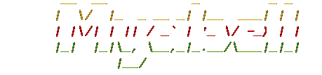

<!-- blank line -->
---
<!-- blank line -->


[](https://www.paypal.com/paypalme/baponkar)

## Version - v-1.0.1
## License : GNU GPL V3.0
## Download link : [This](https://gitlab.com/baponkar/myabell-1.0.0/-/releases/v-1.0.0)

## @bapon_kar [Twitter](https://twitter.com/kar_bapon/status/1285244398570016?s=08) [Telegram](https://t.me/myabell_updates)

## [Youtube](https://www.youtube.com/watch?v=wEsO_JtpelE)
(https://www.youtube.com/watch?v=wEsO_JtpelE)

<!-- blank line -->

<!-- blank line -->


## Description :
### <p style='color:green'>Many usefull application in single app like Browser, Media player, File Converter ,Calculator,Calendar etc.You don't need to install each differently.Just Install Myabell it will fullfill all of your requirements.Time to time I am going to add more important required application.Myabell will be your personal assistant.This version is tested successfully in Ubuntu-18.04</p>

### Dependency :

* Shell Script packages :
- [x] YAD
- [x] curl
- [x] FFMPEG
- [x] XTERM
- [x] enscript
- [x] imagemagick
- [x] bluez
- [x] bluez-tools

* Python3 packages
- [x] Python3.6
- [x] Python-PyQt5
- [x] Py-Sudoku

* During installation above packages will be add in your system.

Screenshot of Myabell

1. Welcome Window
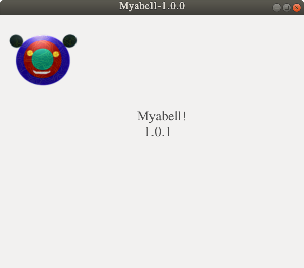

2. Main menu window
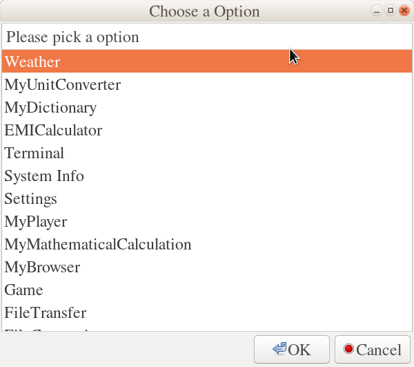
2. My Browser

 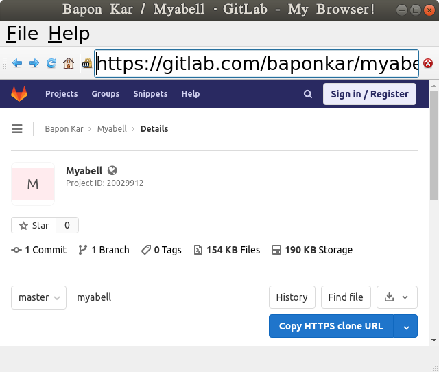

3. My Video/Audio Player
 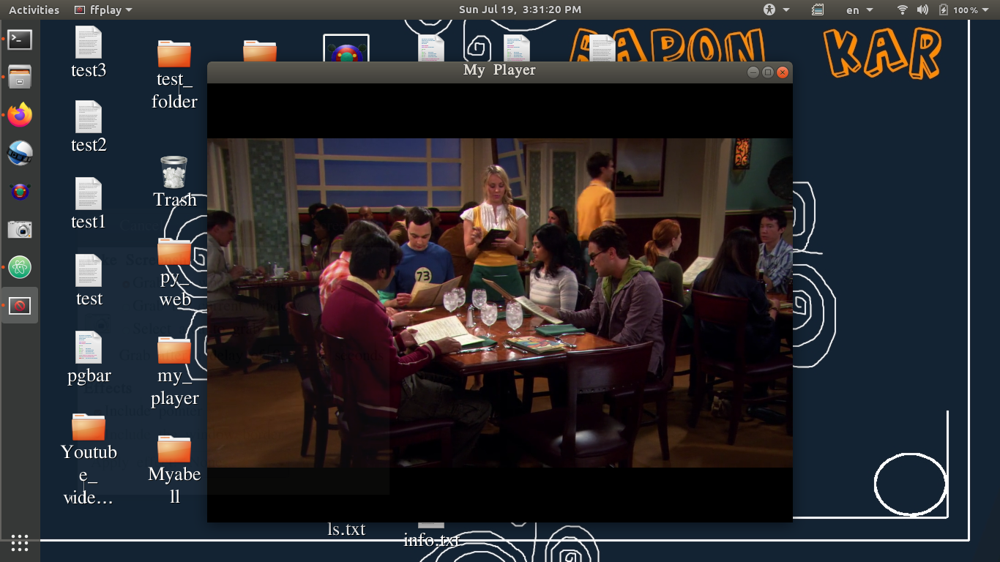
4. My Converting File Options
 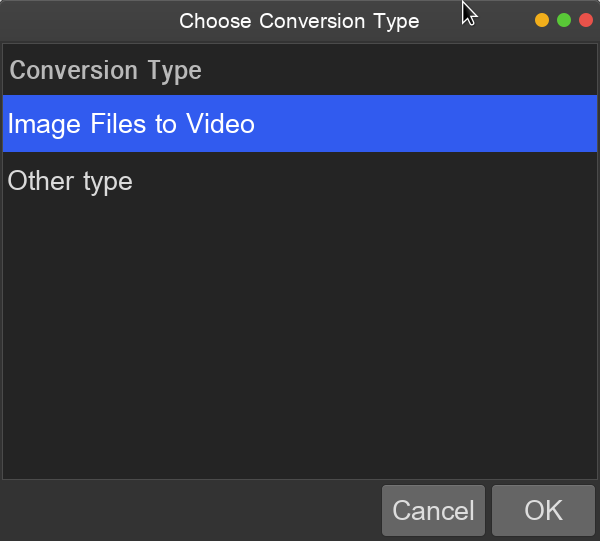
5. My dictionary_screenshot
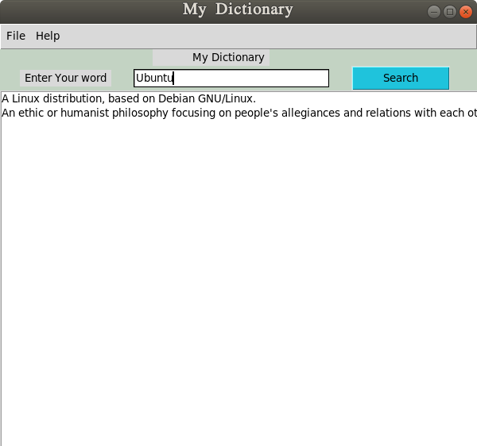

6. My Calender
 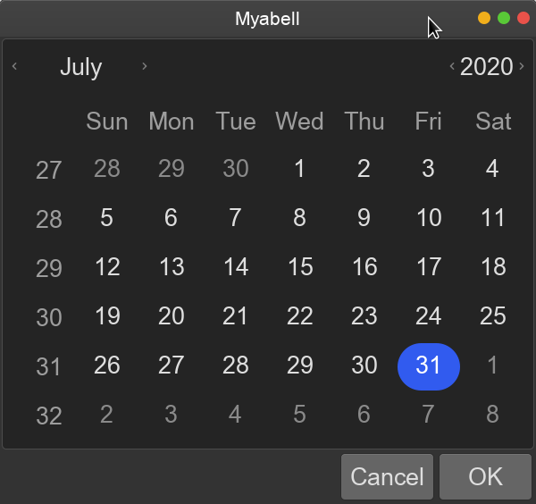


7. File Transfer
   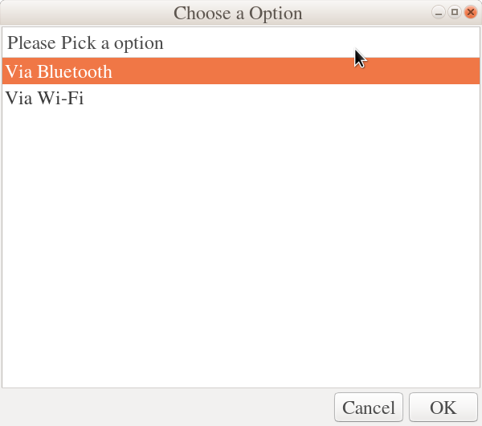

8. About of Myabell
 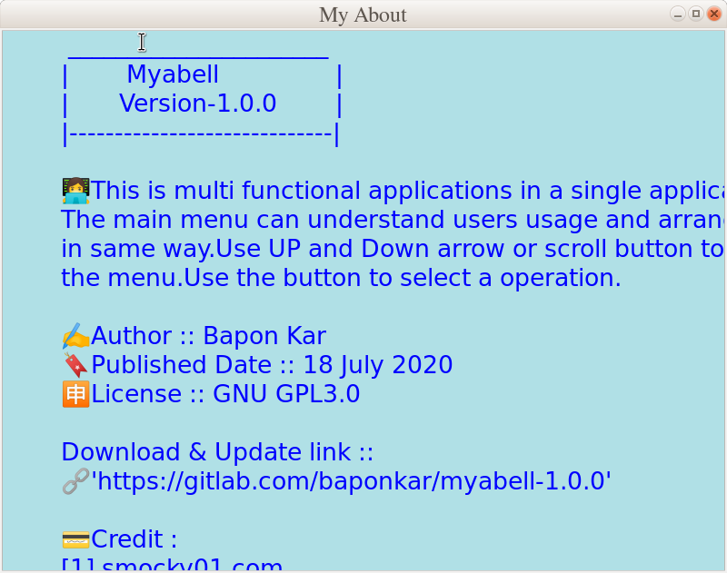
9. Sudoku

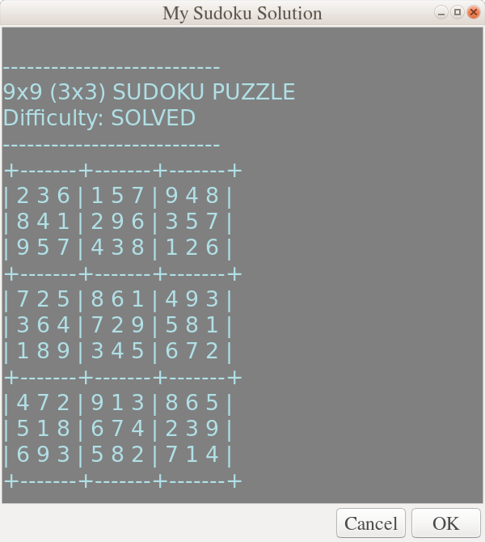
10. Disk Info
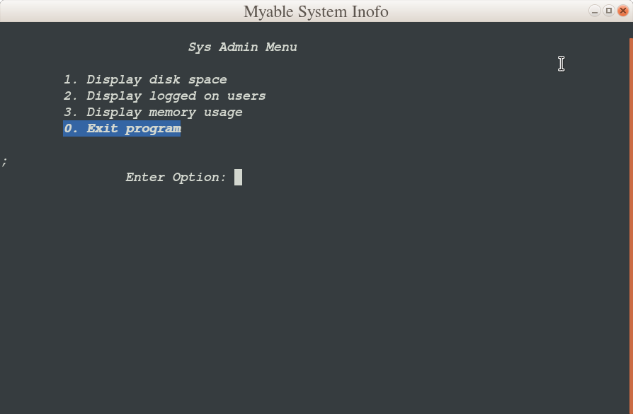
11. EMI Calculator
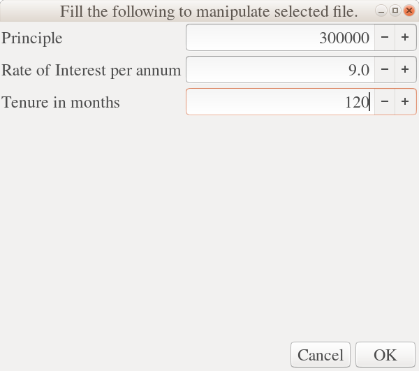
13. My Unit Converter
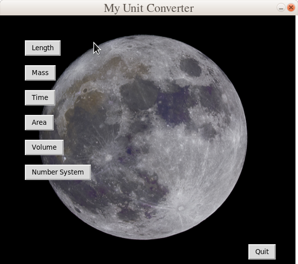
14. Myabell Weather.
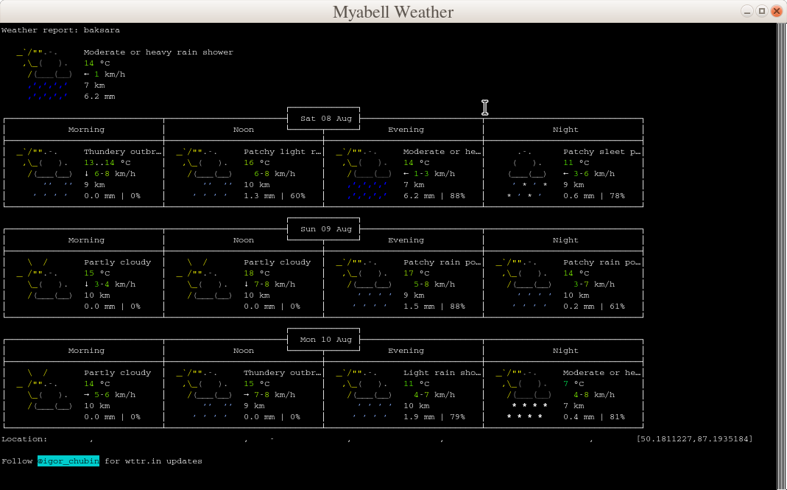
15. Myabell Mathematical Options
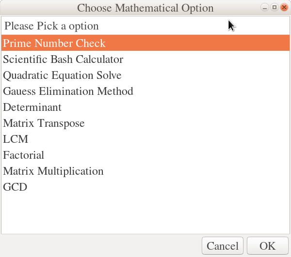
16. My English to Bengali dictionary screenshot

<! -- blank line -->
---
<! -- blank line -->

I have tested this application in Ubuntu-18.04 LTS it was working fine.I think it will work in other distribution too.You may have some issue with File conversion menu as I did not write properly due to lack of time.In future I will repair all those issue and also adding some more usefull menu like GUI Update,Disk Information, Google APP,Personal Chat etc.  

## <p style='color:red'>Installation </p>
1. Download Myabell from this link[108.5MB]  [https://gitlab.com/baponkar/myabell-1.0.0](https://gitlab.com/baponkar/myabell-1.0.0/) and extract
2. Open up Terminal  by (CTRL + ALT + T) and type:
  ```bash
  yourname@yourcomputer:~$    cd location_of_extracted_myabell-1.0.0_folder
 ```
3. Then type this into the terminal
```bash
  yourname@yourcomputer:~$ chmod +x INSTALL.sh
```
4. Then Install mayabell
```bash
  yourname@yourcomputer:~$ ./INSTALL.sh
```
5. Enter your's sudo password and leave it for some time .It will take some time.

6. Now after getting<p style='color:green'> successfull Installationmessage<p style='color:black'>  Now check HOME.

<p style='color:green'>Done!

#### <p style='color:red'>  If this process not worked  then you need to  install by manual process

Follow these prosess step by step

[1] First you follow the above step from 1 to 4 and Then

[2]
```
  yourname@yourcomputer:~$ nano Myabell.desktop
```


[3] You will see
```
[Desktop Entry]
Name=Myabell!
Comment=Many application in single  application.
Exec=/home/$your_machine_name/Myabell-1.0.0/home/script_folder/Myabell.sh
Icon=/usr/share/icons/Myabell_logo.png
Terminal=false
Type=Application
Categories=Utility;
GenericName[en_IN]=File converting application.
```

[4]You need to edit this file, scroll down and change <p style='color:red'>$your_machine_name <p style='color:black'>
 with actual machine name given in time to Ubuntu installation process.

[5] Save it by press 'CTRL + X'.

[6]
 ```
  yourname@yourcomputer:~$ sudo cp Myabell.desktop /usr/share/applications/Myabell.desktop  
 ```
[7]
```
  yourname@yourcomputer:~$ sudo cp Myabell_logo64.png /usr/share/icons
```

[8]
```
  yourname@yourcomputer:~$ sudo apt-get update
  ```

[9]
```
  yourname@yourcomputer:~$ sudo apt-get update
```

[10]
```
  yourname@yourcomputer:~$  sudo apt-get install yad -y
  ```

[11]
 ```
  yourname@yourcomputer:~$ sudo apt-get install python3.6 -y

  ```

[12]
```
 yourname@yourcomputer:~$ sudo apt-get install ffmpeg -y
```

[13]
 ```
  yourname@yourcomputer:~$ sudo apt-get install enscript -y

```

[14]
```
  yourname@yourcomputer:~$ sudo apt-get install imagemagick -y

  ```


[15]
```
  yourname@yourcomputer:~$ sudo apt-get install python3-pyqt5
```

<p style='color:green'>Done ! See HOME . Enjoy Myabell ....

* From step 6-15 is applicable only for [Ubuntu](https://ubuntu.com) distribution .This process may not work in other distribution then you need to find the equivalent suitable commands for your distribuiton.

 The main language is bash shell script with additional python script.


* The associated packages for Myabell

- [x] Yad
- [x] python3.6
- [x] ffmpeg
- [x] enscript
- [x] imagemagick
- [x] python3-pyqt5


 The heart of "My Converter" is [FFMPEG](https://ffmpeg.org) Engine  for file conversion  and [YAD](https://www.gnome-look.org/p/1129668/) software for GUI and also using [enscript](https://www.gnu.org/software/enscript/), [imagemagick](https://imagemagick.org/index.php)So you need to install those two.

 #### <p style='color:red'> Uninstall

 [1] Open Terminal by CTRL + ALT + T
 [2]
  ```
yourname@yourcomputer:~$ chmod +x UNINSTALL.sh
  ```

  [3]
  ```
   yourname@yourcomputer:~$ ./UNINSTALL.sh```
```

* I will like any suggestion and comments.Thankyou.


>
